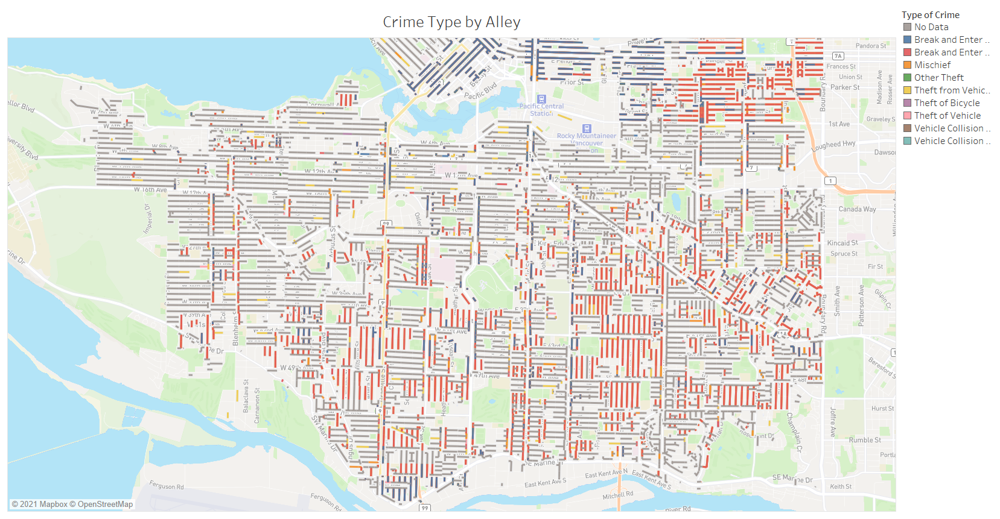
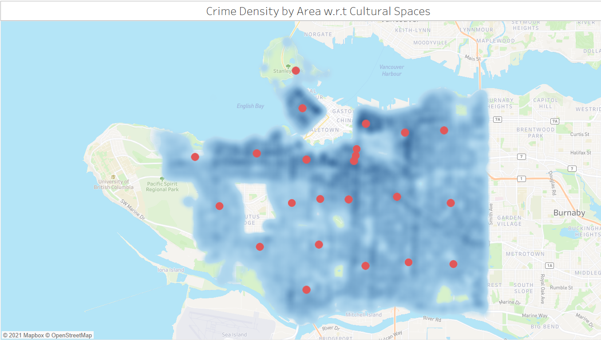
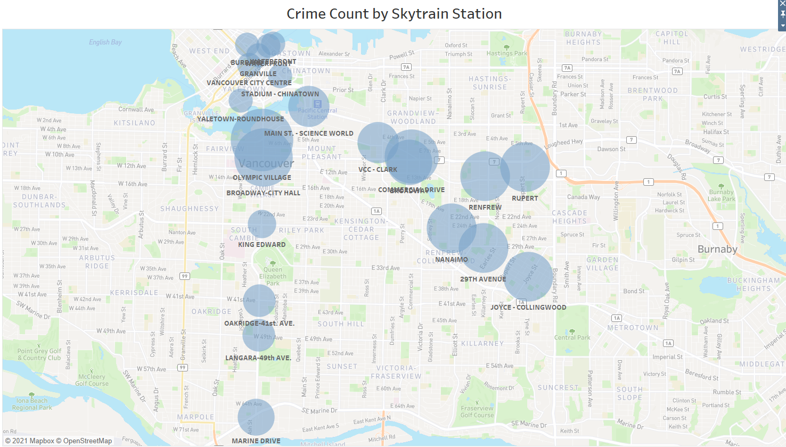
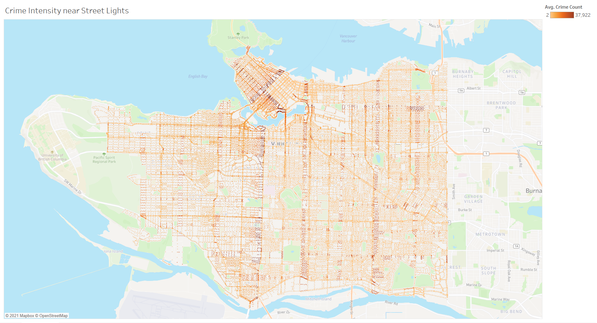
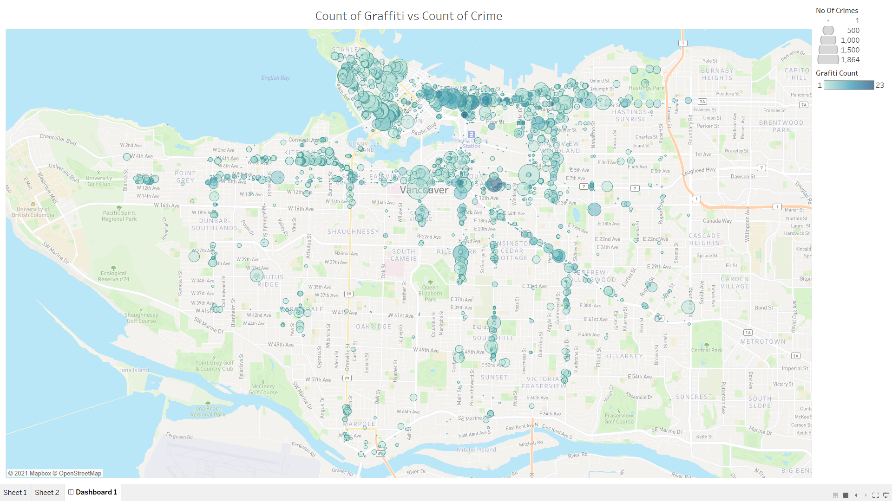
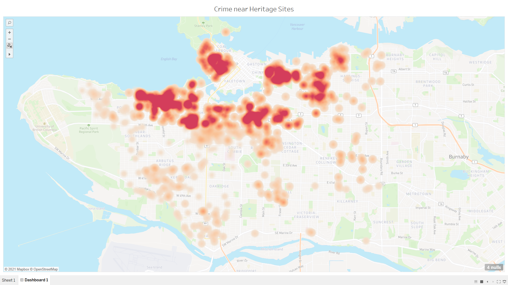
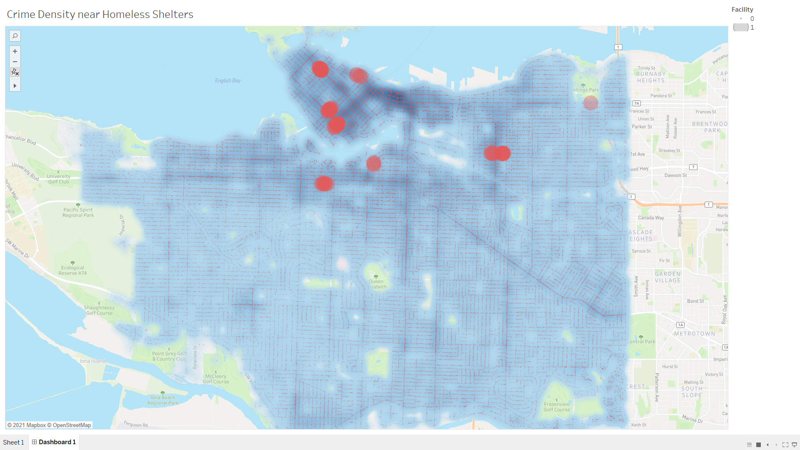
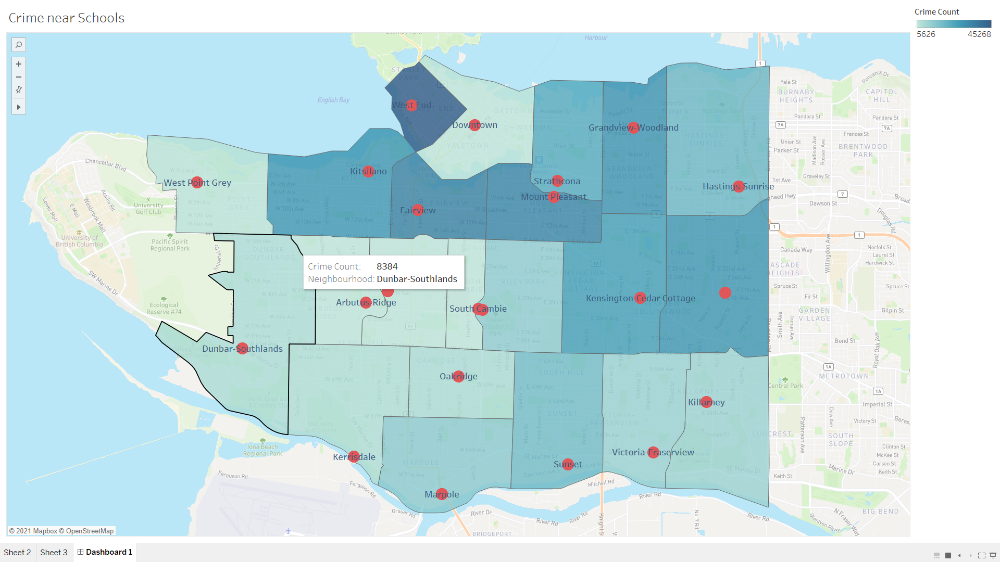
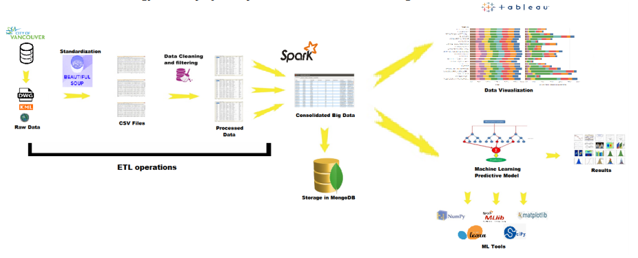
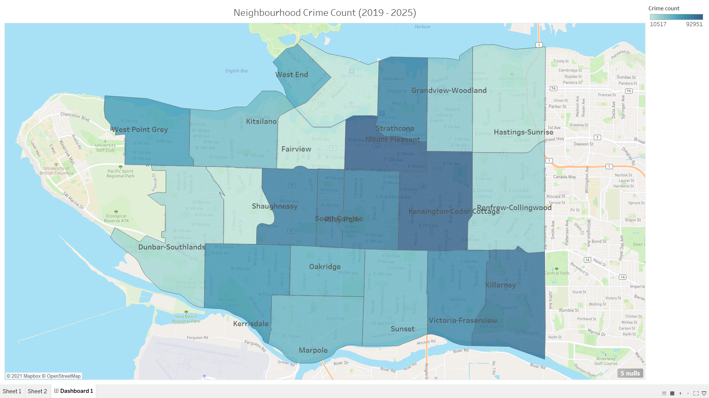

# Analysis and Prediction of Crime in Vancouver,BC

Vancouver has consistently been rated as one of the most liveable cities in the world. However, it also retains a
higher crime rate than most cities in Canada with a lot of diversity in types of crime committed. The Vancouver
Police Department (VPD) releases crime reports on a weekly basis to the Open Data Catalogue of Vancouver,
which is a government repository that maintains several different datasets containing information about various
aspects of the city such as Schools, shelters for homeless people, public parks, cultural spaces and many more.
Looking at each of these aspects, we wish to determine whether any underlying connection exists between them
and any crime that may occur nearby.
      Our aim is to determine the correlation between crime in Vancouver and each of these factors so as to be able
to answer questions about the safety of each and to find patterns in occurrence of crime and how it relates to the
locations of these various factors. In the end, our analysis would be useful in answering hundreds of questions,
some of which could be :
* Which schools have a low proportion of crime going on nearby?
* Do shelters for homeless people influence crime in a given neighbourhood?
* What types of crime are prevalent near beaches and how could you safeguard against them?
* How much is the reduction in crime during the result of a municipal election?
…and many more
 Moreover, not only is this data useful for visualizing our analysis of crime, but each dataset could be used as
a feature for training an algorithm to predict the number of crime occurences and their type for a given location.
However, this consolidation of various datasets to determine correlation gives rise to the problem of exponentially
increasing data per factor, running into several Gigabytes , which necessitates the need to use technologies which
can handle and manipulate such a vast amount of data.

## Notable Observations
   We compared the crime dataset with multiple datasets that can be viewed in the <a href="../Data">Data/</a> folder.
### 1) Analysing Crime by Lanes
With a total of 7827 lanes in the city, we attempt to undertake an analysis of crime that occurs with respect to city lanes - in other words, we want to understand the correlation of lanes with crime in the city. This can help us answer popular questions such as:
Which lanes have a prevalence of crime ?
How can lanes be categorized with the prevalence and/or type of crime that occurs in them ? and so on. Such observations are useful to a variety of entities. In the most obvious context, it helps law enforcement agencies concentrate their efforts in these particular lanes and also alerts residents of potential dangers that might occur in their vicinity. After a lengthy data processing effort (which can be viewed <a href="../Notebooks/Lanes.ipynb">here</a>) we load into Tableau to visualize the results. Given below is a sample Map visualization depicting Type of crime by Alley. The tableau public dashboard can be viewed at : <a href="https://public.tableau.com/views/Crime_CulturalSpace/Dashboard1?:language=en&:display_count=y&publish=yes&:origin=viz_share_link">https://public.tableau.com/views/Crime_CulturalSpace/Dashboard1?:language=en&:display_count=y&publish=yes&:origin=viz_share_link</a>.


### 2) Associating Crime with Cultural Spaces
Another popular dataset found in the City of Vancouver Open Data Catalogue is one that lists the cultural spaces in the city. With a total of 388, these cultural spaces present an opportunity to undertake an analysis of crime that occurs with respect to city cultural spaces - in other words, we want to understand the correlation of lanes with crime in the city. This can help us answer popular questions such as:
* Is there a prevalence of crime near cultural spaces?
* Is any particular type of cultural space associated with more/less crime? and so on. Such observations are useful to a variety of entities. In the most obvious context, it helps law enforcement agencies concentrate their efforts in these particular spaces and also alerts residents of potential dangers that might occur in their vicinity.Given below is a sample Map visualization depicting Crime Density near Cultural Spaces. The tableau public dashboard can be viewed at : <a href="https://public.tableau.com/views/Crime_CulturalSpace/Dashboard1?:language=en&:display_count=y&publish=yes&:origin=viz_share_link">https://public.tableau.com/views/Crime_CulturalSpace/Dashboard1?:language=en&:display_count=y&publish=yes&:origin=viz_share_link</a>.


### 3) Relation of Crime with Skytrain Stations
Although it is a popular gossip that certain skytrain stations are notorious for crime, let us use the public data to figure out if there is any truth to the matter. Among the many datasets found in the City of Vancouver Open Data Catalogue is one that lists skytrain stations in the city. There are a total of 22 stations, each of these belong to one of the following three transit lines:
* Millenium Line
* Expo Line
* Canada Line 
The dataset is in the.kml geographic format and we have a script (Found in the Source folder) that can convert it to a csv file format and convert the original X,Y co-ordinate system to latitude,longitude pairs. In this particular notebook, we attempt to undertake an analysis of crime that occurs with respect to city skytrain stations - in other words, we want to understand the correlation of skytrain station with crime in the city. This can help us answer popular questions such as: Which stations have a prevalence of crime ? How can skytrain stations be categorized with the prevalence and/or type of crime that occurs in them ? and so on. Such observations are useful to a variety of entities. Given below is a sample Map visualization depicting Crime Counts near Skytrain stations. The tableau public dashboard can be viewed at : <a href="https://public.tableau.com/shared/NTGFY2TG6?:display_count=y&:origin=viz_share_link">https://public.tableau.com/shared/NTGFY2TG6?:display_count=y&:origin=viz_share_link</a>.


### 4) Crime v/s street lighting
The stereotype of crime in a city is that most crime occurs in dark, shady alleys vs. in broad daylight. Since the Vancouver Open Data Catalogue has a neat little dataset that lists street lighting poles throughout the city, we take it upon ourselves to analyse if there is any truth in this notion that crime occurs away from lighting and in more remote places. The street lights are plotted on the map in a range of yellow to orange to red. The color intensity changes from yellow to red with the intensity of crime. The Tableau public dashboard can be found at The tableau public dashboard can be viewed at : <a href="https://public.tableau.com/views/StreetLighting_Crime/Dashboard1?:language=en&:display_count=y&publish=yes&:origin=viz_share_link">https://public.tableau.com/views/StreetLighting_Crime/Dashboard1?:language=en&:display_count=y&publish=yes&:origin=viz_share_link</a>.


### 5) Occurences of Crime near Graffiti
Graffiti is a common sight in Vancouver, with many of the city's buildings adorned in various artwork and murals. Since graffiti is actually illegal in Vancouver, we postulate that it may have a correlation with reduced levels of law enforcement in the vicinity and hence an increased rate of crime. We now seek to use the Graffiti Open Dataset from the catalogue to verify if there is any truth to this statement.The locations with graffiti are plotted on the map in blue markers. The size of the marker represents the No of crimes where as their color intensity depicts count of graffiti. It can be directly observed that there is no semblance between count of graffiti and crime intensity. i.e the biggest bubbles are not the most intensely colored. The Tableau public dashboard can be found at :  <a href="https://public.tableau.com/profile/jamshed.khan#!/vizhome/HomelessShelters_Crime/Dashboard1?publish=yes">https://public.tableau.com/profile/jamshed.khan#!/vizhome/HomelessShelters_Crime/Dashboard1?publish=yes</a>.


### 6) Crime near Heritage Sites
There are approximately 2200 structures listed as heritage sites within the Vancouver city limits. In this notebook, we attempt to take a close look at how much crime is committed in the vicinity of these sites.The map shows crime density near heritage sites. The deeply red areas are those that house a lot of crime near heritage sites. The other markers represents heritage sites and highlights the severity of crime near them. Click on a marker to view the count of crime in the vicinity and the name of the heritage site. The Tableau public dashboard can be found at: <a href="https://public.tableau.com/views/HeritageSites_Crime/Dashboard1?:language=en&:display_count=y&publish=yes&:origin=viz_share_link">https://public.tableau.com/views/HeritageSites_Crime/Dashboard1?:language=en&:display_count=y&publish=yes&:origin=viz_share_link</a>.


### 7) Establishing the link between Crime and Homeless Shelters
According to statistics, the presence of a homeless shelter appears to cause crime to increase by 56% within 100m of that shelter, with thefts from vehicles, other thefts, and vandalism driving the increase. The Vancouver open Data catalogue provides us a list of Homeless shelters within city limits along with their exact co-ordinates in the same dataset. By plotting it against crime in the vicinity, we shall attempt to establish by ourself if there is any truth to this statement, atleast for the city of Vancouver. The locations with homeless shelters are plotted on the map in big red markers. The size of the marker represents the No of homeless shelters where as their color intensity (blue )depicts crime intensity. The Tableau public dashboard can be found at: <a href="https://public.tableau.com/views/Crime_vs_Graffiti/Dashboard1?:language=en&:display_count=y&publish=yes&:origin=viz_share_link">https://public.tableau.com/views/Crime_vs_Graffiti/Dashboard1?:language=en&:display_count=y&publish=yes&:origin=viz_share_link</a>.


### 8) Analysing Crime near Schools
Perhaps one of the most important analysis from a safety point of view is to examine the intensity of crimes occuring near schools. In this exercise, we shall attemot to perform multiple visualizations to understand this. The locations of schools are plotted on the map in red markers. The neighbourhoods can be observed with boundaries thanks to the shapefile provided by the Open Data Catalogue. We can visualize the neighbourhoods based on their crime intensity on the color scale. The Tableau public dashboard can be viewed at: <a href="https://public.tableau.com/views/School_Crime/Dashboard1?:language=en&:display_count=y&publish=yes&:origin=viz_share_link">https://public.tableau.com/views/School_Crime/Dashboard1?:language=en&:display_count=y&publish=yes&:origin=viz_share_link</a>.


## Pipeline 
The pipeline architecture used here is depicted as follows:

We used Tableau to visualize our data and perform analysis. We chose Tableau because setting up takes minimal time, it does not need complex queries for visual analysis and data can be visualized in hundreds of ways. Besides, Tableau works on data sources directly and utilises ready memory. We described a variety of graphs, plots, histograms and maps so as to make the visualizations as easy to interpret for naïve users as possible.

## Predicting Future Crimes
The Spark ML library presents some excellent models and structures that make use of inbuilt machine learning methods to build ML pipelines and workflow. Let us see if we can deploy one such pipeline using any of the provided models to predict future occurences of crime in the city of Vancouver. Using our dataset of crime, we can feed the model with occurences of crime over the past 15 years to have it estimate crimes that are likely to occur in the coming years. We have several excellent features that can be used to that effect. Some of them are:
* Neighbourhood
* Co-ordinates (Lat,Long)
* Hundred-block
and so on. For this prediction, we shall use a Multinomial Logistic Regression model. Logistic regression analysis is used to examine the association of (categorical or continuous) independent variable(s) with one dichotomous dependent variable. This is in contrast to linear regression analysis in which the dependent variable is a continuous variable. For this purpose, we will use the 'supercrime.csv'dataset. This dataset is an amalgation of the crime dataset joined on every other dataset : such as churches, schools, street_lights, skytrain_stations, police_quarters etc. from the Open Data Catalogue. The point is to use all of these as feature vectors that can help us make a more efficient prediction as to the future crime spots. For the predictor column, we shall choose the "Neighbourhood" column since it is discrete and ties in well with the use-case of Multinomial Logistic Regression.
Using the predictive model <a href="../Source/SparkMLData">here/</a> on a dataset containing time periods from 2019 to 2025, we were able to obtain the Neighbourhood name of a given crime (by the prediction) and then plot it on the Tableau Map. Since we have a Neighbourhood Shape file (obtained from the Open Data Catalogue), we can plot a visualization with Tableau that shows the Crime count by Neighbourhood as predicted by our model. The Tableau public dashboard can be found at <a href="https://public.tableau.com/views/School_Crime/Dashboard1?:language=en&:display_count=y&publish=yes&:origin=viz_share_link">https://public.tableau.com/views/School_Crime/Dashboard1?:language=en&:display_count=y&publish=yes&:origin=viz_share_link</a>.


## Requirements
* Tableau 2018.3
* BeautifulSoup4
* Pandas 0.23.3
* Numpy 1.15.3
* PySpark v2.4.0
* Seaborn 0.7.1
* Geopy 3.5
* MongoDB
* <a href="https://pypi.org/project/reverse_geocoder/">Reverse_Geocoder</a>

## Running Instructions
These instructions refer to running the Logistic Regression model to predict crime neighbourhoods for a selected period of time. The detailed working can be viewed in <a href="../Notebooks/Regression.ipynb">this notebook.</a> Running the program will either build a local file with prediction values for Crime Neighburhood in the future or upload it to the MongoDB database as the "Predictions" table. The option can be selected as per the "switch" key in the companion Json file (interpreted as Python3 dictionary.) The table can then be fed to the Tableau connector via commandline.

```
spark-submit --driver-memory 8G --executor-memory 8G --num-executors 4 --executor-cores 2 main.py

```

## Difficulties faced
Here we outline some of the difficulties faced by us during this project. 

* Data Quality : While performing initial data exploration, we found that lots of data was missing, containing unwanted characters or filled with noise and had to be filtered and cleaned extensively.

* Data Volume : By nature, the datasets on the Open Data Catalogue are notorious for their extreme size - a given, as they represent decades of city-wide data. Joining such Big Datasets on a local machine presented a considerable challenge. However, the Spark system proved invaluable here for its knack of considerable speeding up operations. A few tricks we utilized included -caching of dataframes, Broadcast joins, Repartitioning

* Since we utilize a relational database and the very nature of analysing correlations between datasets requires joining them on a common relation, we attempt to do so on location as most of the time that is the only common aspect. However, all these datasets by default utilize a co-ordinate system for location(Latitude,Longitude). The problem we face is that a 13th order co-ordinate (13 decimal places for lat/long) narrows a location to a single block and thus it is not possible to relate entities. For example, if a crime occurs at location(x,y) how are we to equate a Skytrain station at location(u,v) that is nearby ? We solve this problem by intodrucing a "HUNDRED_BLOCK" parameter using APIs that generalize a latitude,longitude pair to a hundred block radius.

* Most online APIs that generate such geocode such parameters do not permit Big Data processing i.e. they limit the amount of requests. Offline ones do not narrow down a parameter as is desired for our exercise, usually returning a city or wherabouts as the minutest identification. To overcome this problem, we are obliged to build our own tree-like datastructure and retain it into memory. This way we can store a large amount of parameters through reverse-geocoding with a rather insignificant number of requests to the API. (although still running in tens of thousands.)

* To train our Spark ML model, we realized that our sample dataset was heavily skewed. Majority of reported crimes occur in a single neighbourhood. Whether this is data discrepancy or actually so, our initial model turned out to be heavily biased - predicting all future crime to be taking place in the same neighbourhood. We were able to resolve bias by using methods such as assigning class weights and using LogisticRegressionWithLBFGS (which utilizes L-BFGS instead of the traditional Stochastic Gradient Descent) to increase the accuracy of our model from a measly 24% to 68%.


