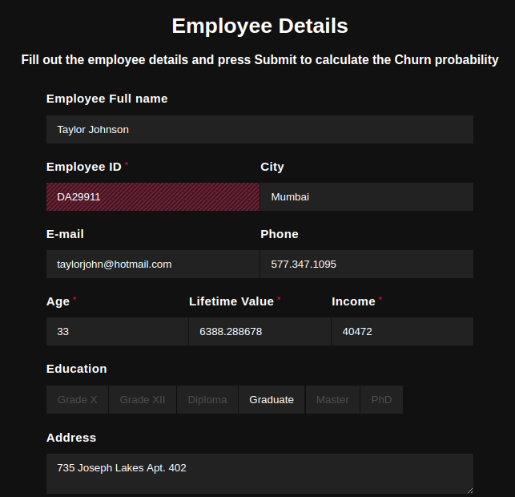

# Retaining Insurance customers with Churn Prediction
The essence of this project is to showcase an application for a predictive model while at the same time learning the basics of data ETL, pipelines and machine learning with <a href='https://www.h2o.ai/?utm_source=google&utm_medium=cpc&utm_term=machine%20learning&utm_campaign=ml&gclid=CjwKCAjwx9_4BRAHEiwApAt0zhoKsW3UFygiJN6hCCdQZOGC3tDtof0gVla0ns8wfPbctTYatUrAORoCOMcQAvD_BwE'>H2O</a>, Apache Spark and Flask.

## Concept
Customers are said to "Churn" when they stop using a company's product or services. In this particular use case, we refer to customer churn as the percentage of people that do not renew their insurance policy after it expires its term. A great many factors may contribute to a customer's decision to purchase insurance again. The ability to predict whether a particular customer is at a high risk of churning, while there is still time to do something about it, avoids a direct loss of revenue for a business. It is usually more difficult and expensive to acquire a new customer than it is to retain a current paying customer. Take a look at this [tutorial](Churn_tutorials/Basic_churn_prediction.ipynb) to see how a basic RandomForest model with sklearn and python can make predictions about customer churn.

## Process Workflow
The project is broadly divided into two parts: [Preprocessing/ETL](https://github.com/jsully1996/Data_Analytics_Projects/tree/master/Insurance_Customer%20_Churn/Preprocessing_and_ETL) and [Predictive modelling](https://github.com/jsully1996/Data_Analytics_Projects/tree/master/Insurance_Customer%20_Churn/Modelling_with_H2O). In the ETL part, we first bring in our original(confidential) dataset and join it with another dataframe that was synthetically generated using FAKER. The process is displayed in the notebook [Synthetic Data Gen.ipynb](Preprocessing_and_ETL/Synthetic Data Gen.ipynb) to preserve the confidentiality of our original data. In the next [notebook](Preprocessing_and_ETL/Extraction and Cleaning.ipynb), we undertake data cleaning procedures to refine the dirty dataset and make it suitable to store in the database. This entire process is performed with Apache Spark, wherein we perform some of the following procedures:<br>
1.Dropping Rows With Empty Values<br>
2.Dropping Duplicate Rows<br>
3.Standardize Individual columns<br>
4.Drop columns not relevant to the predictive model.<br>
Next, we transform the data ([Transform and Load.ipynb](Preprocessing_and_ETL/Transform and Load.ipynb)) so as to make it easier to process for the ML model. This is done by converting categorical columns to corresponding numeric values, a process called One Hot Encoding. After all this is done we then proceed to Load the data into a local MySQL database.<br>
In the [next part](https://github.com/jsully1996/Data_Analytics_Projects/tree/master/Insurance_Customer%20_Churn/Modelling_with_H2O), we actually use all that data to train a model to come up with new predictions. H2O offers several advantages over conventional machine learning libraries. Essentially, its ease of integration with the Spark API and customized features such as AutoML give it an edge for this use case. Firstly, we create a SparkSession, set the SparkContext and read the data stored in the MySQL database into a Spark Dataframe. Next, we need to setup an H2O cluster inside this Spark Cluster.<br> <br>Then next, convert the Spark dataframe to an H2O dataframe and use it to train a Random Forest model. Alternatively, we can also use H2O's inbuilt AutoML feature, which automates the process of building a large number of models, with the goal of finding the "best" model without any prior knowledge or effort by the Data Scientist. This model is then saved locally.<br>

The next part of our exercise is to use the model to make predictions. To envision this, we have established a "front-end" for individuals that are likely to make us of predictive analytics in the form of a python web app. The basic working is as follows: A simple html form built using Flask that collects the data relevant to the ML model(see image above), and in the back end feeds it to the model as a validation data set, thus returning a prediction. In practice, this can be used by interested individuals to calculate churn probability for individual customers. As seen [here](Modelling_with_H2O/RandomForest_H2O.ipynb), the RF model has an accuracy of ~75% without hyperparameter tuning.

### Instructions to Run
Most of the work is accessible as iPython notebooks. To access the web front-end, please visit:<br>
## http://churn-000.herokuapp.com/<br>
The link will redirect to the Flask App hosted on Heroku in the format of an HTML form, that is prefilled with sample customer(Employee) data(Age, Policy, Location etc.). Simply click on submit and wait for the app to calculate and display the churn probability.<br>
Alternatively, follow these instructions to run the demo on your local machine:<br>
Make sure you have the <b>prerequisites</b>
```
Flask==1.1.2
h2o==3.30.0.7
numpy==1.19.1
py4j==0.10.9
pyspark==3.0.0
pysparkling==0.6.0
requests==2.24.0
virtualenv==20.0.23
Werkzeug==1.0.1
```
Next, clone the repository via
```
git clone https://github.com/jsully1996/Data_Analytics_Projects
```
navigate to "/Insurance_Customer_Churn" and then
```
python3 main.py
```
